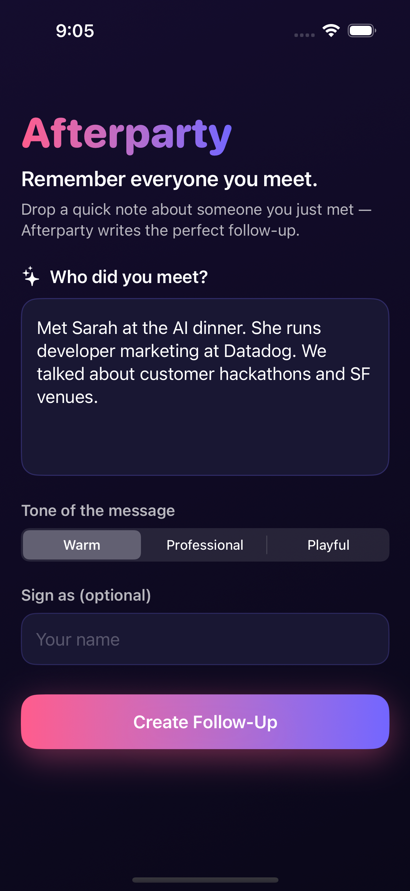
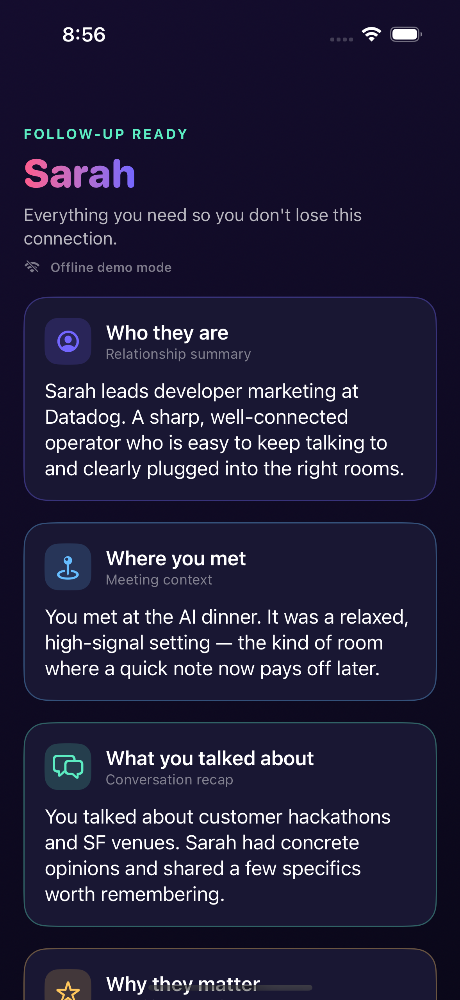

# Afterparty

**Remember everyone you meet.**

> "I scanned everyone I met last night and it wrote my follow-ups."

Afterparty turns a quick note about someone you just met into a complete,
ready-to-send follow-up — so you never lose the people you meet.

You jot down a sentence or two ("Met Sarah at the AI dinner. She runs developer
marketing at Datadog…"), tap **Create Follow-Up**, and Afterparty gives you
eight cards: who they are, where you met, what you talked about, why they matter,
when to follow up, a drafted message, intro ideas, and a reminder note.

---

## What the app does

A single text field captures a free-form note about a person. The engine sends
it to an AI provider and parses the reply into eight typed sections, each
rendered as its own card:

| Section | What it gives you |
| --- | --- |
| **Who they are** | A relationship summary |
| **Where you met** | The meeting context |
| **What you talked about** | A conversation recap |
| **Why they matter** | Why this connection is valuable |
| **When to follow up** | A concrete timing recommendation |
| **Drafted follow-up** | A message ready to send |
| **Possible intros** | People/resources worth connecting them with |
| **Reminder note** | A one-line memory hook |

> **MVP input.** Today the only input is a typed/pasted note (the screens also
> include a tiny voice-note-to-text affordance stub). Future versions are
> designed to accept a **badge photo, business card, LinkedIn screenshot, or
> LinkedIn QR code** — but camera/OCR/QR scanning is intentionally **not** built
> yet. The architecture keeps the input layer swappable so those can be added
> later without touching the engine.

This is deliberately **not** a CRM, team workspace, graph database, LinkedIn
automation tool, or sales pipeline. It does one thing: capture a person,
remember the context, and write the follow-up.

---

## Architecture

The project is split so that **all real logic is verifiable on Linux**, while
the SwiftUI app stays a thin presentation layer on top.

```
afterparty/
├── Package.swift                 # Swift Package: the AfterpartyKit library
├── Sources/AfterpartyKit/        # ← all business logic (compiles + tests on Linux)
│   ├── Models/                   # Codable models for input & the 8 output sections
│   │   ├── PersonNote.swift
│   │   ├── FollowUpRequest.swift
│   │   ├── FollowUpTone.swift
│   │   ├── FollowUpSectionKind.swift
│   │   ├── FollowUp.swift            # the 8 typed output fields + `sections`
│   │   ├── FollowUp+Fallback.swift
│   │   └── AfterpartyError.swift
│   ├── Engine/
│   │   ├── InputParser.swift         # heuristic name/company/role/topic hints
│   │   ├── PromptBuilder.swift       # system + user prompt construction
│   │   └── FollowUpEngine.swift      # validates input, delegates to a provider
│   └── Providers/
│       ├── AIProvider.swift          # async protocol: request -> FollowUp
│       ├── MockProvider.swift        # deterministic, offline, no API key
│       └── ClaudeProvider.swift      # real Anthropic Messages API via URLSession
├── Tests/AfterpartyKitTests/     # XCTest suite (runs on Linux, no network/key)
├── App/Afterparty/               # SwiftUI app (thin; runs on iOS / Xcode)
│   ├── AfterpartyApp.swift
│   ├── Views/                    # InputView, ResultsView, SectionCard, Loading…
│   ├── ViewModels/FollowUpViewModel.swift
│   ├── Theme/Theme.swift
│   └── Support/AppConfig.swift   # provider selection + -UITEST_MOCK handling
├── AfterpartyUITests/            # XCUITest: screenshots input + results screens
├── project.yml                   # XcodeGen project definition
└── .github/workflows/            # Linux tests + macOS iOS-Simulator UI tests
```

### The AI layer

- **`AIProvider`** — a protocol with one async method:
  `func generateFollowUp(for request: FollowUpRequest) async throws -> FollowUp`.
- **`MockProvider`** — fully deterministic and offline. Its canned content is
  modelled on the Sarah / Datadog example and lightly personalised with hints
  from `InputParser`, so different notes produce different (but realistic)
  output. **Tests and SwiftUI previews use this**, and it needs no network and
  no API key.
- **`ClaudeProvider`** — calls the real Anthropic Messages API
  (`https://api.anthropic.com/v1/messages`, `x-api-key`, `anthropic-version:
  2023-06-01`) with `URLSession`. Model: **`claude-sonnet-4-5-20250929`**. The
  API key is read from the `ANTHROPIC_API_KEY` environment variable / Info.plist
  and is **never hardcoded**. The model is asked to return JSON, which is parsed
  robustly (it recovers JSON from code fences/prose and falls back to a usable
  message if parsing fails).

All output is decoded into the typed `FollowUp` struct — one `Codable` field per
required section — so the UI just renders `followUp.sections`.

---

## Run the tests (Linux or macOS)

The core engine builds and is fully unit-tested with **no network and no API
key**:

```bash
swift build
swift test
```

> On Linux, install the Swift toolchain from [swift.org](https://www.swift.org/install/)
> if `swift --version` is missing. CI runs the suite in the `swift:6.1-jammy`
> container — see [`.github/workflows/linux-tests.yml`](.github/workflows/linux-tests.yml).

The suite covers: every required output section is produced (via `MockProvider`),
`Codable` round-trips for all models, prompt construction includes the user input
and all output sections, the heuristic parser, and edge cases (empty / very short
/ emoji-only input).

---

## Open & run in Xcode (Mac + iOS Simulator)

The Xcode project is generated from `project.yml` with
[XcodeGen](https://github.com/yonaskolb/XcodeGen):

```bash
brew install xcodegen      # once
xcodegen generate          # regenerate Afterparty.xcodeproj from project.yml
open Afterparty.xcodeproj  # then press ⌘R on an iOS Simulator
```

A generated `Afterparty.xcodeproj` is also committed for convenience, but
`xcodegen generate` is the source of truth — re-run it after editing
`project.yml`.

### Setting `ANTHROPIC_API_KEY`

The app falls back to the offline `MockProvider` automatically, so it runs and
demos with no setup. To use the **live Claude provider**:

- **In Xcode:** Product → Scheme → Edit Scheme → Run → Arguments → *Environment
  Variables*, add `ANTHROPIC_API_KEY` = your key. (Or inject it into the build
  settings so it flows into Info.plist's `ANTHROPIC_API_KEY` entry.)
- **From the command line / CI:** export `ANTHROPIC_API_KEY` before building.

The key is read at runtime by `AppConfig` and is never committed.

---

## Screenshots / Simulator

These are produced by a **real iOS Simulator** on a GitHub-hosted macOS runner.
The [`ios-simulator`](.github/workflows/ios-simulator.yml) workflow runs an
**XCUITest** that launches the app with `-UITEST_MOCK 1` (the offline
`MockProvider`, so it needs no network and no API key), drives it to the results
screen, and captures these screenshots. They are uploaded as workflow artifacts
**and committed here** so they render below.

| Input screen | Populated results |
| --- | --- |
|  |  |

> If the images above are not yet visible, the macOS UI-test job is still
> running on the PR — it commits the real screenshots when it finishes.

---

## How it's tested in CI

Two jobs, both must be green:

1. **Linux** (`ubuntu-latest`, `swift:6.1-jammy`): `swift build && swift test`.
2. **macOS** (`macos-14`): `xcodegen generate` → `xcodebuild` build for an iOS
   Simulator → run the XCUITest target → extract + commit screenshots → upload
   artifacts (screenshots, an optional screen recording, and the `.xcresult`).
